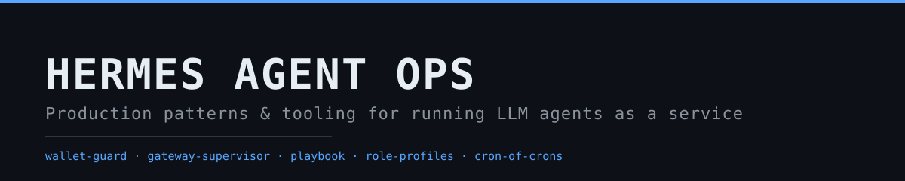

<p align="center">
  
</p>

<p align="center">
  <a href="#"></a>
  <a href="#"></a>
  <a href="#"></a>
  <a href="#"></a>
  <a href="#"></a>
  <a href="#"></a>
</p>

# Hermes Agent Ops

Operational patterns, tooling, and incident records for running LLM agents as a 24/7 service. The repository covers spend guards, external process supervision, multi-role profile architecture, self-observing scheduled jobs, and the post-mortems behind each component. Everything here is generalized from a production deployment that has been operating around the clock — every artifact is either runnable code or a configuration template that was exercised in that environment.

The primary target is [Hermes Agent](https://hermes-agent.nousresearch.com); the patterns and most of the tooling apply to any agent gateway with a scheduler, a state store, and provider APIs.

---

## Overview

Agent deployments fail in a small set of recurring ways: one session grows until it dominates spend and response quality, the gateway process stays alive while refusing new writes, scheduled jobs drift silently, and documentation of the schedule diverges from reality. This repository treats those failure modes as engineering problems with defined detection and response paths:

- spend is anchored to the provider balance and attributed per session,
- process health is judged by heartbeat *and* fatal log markers, from outside the gateway,
- every scheduled prompt is checked for self-containment before it ships,
- the ops documentation is generated from the job list rather than maintained by hand.

The repository is a monorepo: fourteen modules under numbered directories, each independently readable, all cross-referencing through `SERIES.md`.

---

## Architecture

```
                        ┌──────────────────────────────┐
   human (DM/topics) ──▶│  gateway + role profiles      │◀── SOUL.md per role
                        │  coordinator · chef · doctor  │    model pinning
                        │  operator (3rd model)         │    topic walls
                        └──────────────┬───────────────┘
                                       │ state DB + logs + heartbeat file
        ┌──────────────┬───────────────┼────────────────┬────────────────┐
        ▼              ▼               ▼                ▼                ▼
   scheduler      gateway           wallet guard     usage DB        backups
   (cron jobs)    supervisor        (every 30 min)   (sqlite)        (daily)
      │           (external)            │
      │           + guard cron          ▼
      ▼                           cost dashboard
   no-agent watchers              (attribution)
   LLM digests (gated)
   one-shot reminders
```

Three properties hold at every layer:

1. **Watchers are watched by a different layer than the one they watch.** The gateway is supervised by an external daemon; the daemon is re-spawned by a scheduler-owned guard cron; the schedule itself is audited by a daily operator sweep running on a separate model.
2. **Silence is a valid state.** Watchers print nothing when healthy; the scheduler delivers nothing on empty stdout.
3. **Nothing heals from the inside.** Restart, restore, and escalation paths live outside the gateway, and state is never auto-restored by a robot.

---

## Features

| Module | Responsibility |
|---|---|
| `01-agent-wallet-guard` | Measures the provider balance directly; alerts on floor breaches and daily burn, naming the top session by cache-read tokens. Silent when healthy. |
| `02-agent-gateway-supervisor` | External daemon as a **systemd user unit** (not a cron guard): heartbeat staleness + fresh fatal log markers; restarts only via `systemctl` (polkit grant); cooldown + hourly cap; maintenance pause; escalation instead of auto-restore. |
| `03-agent-ops-playbook` | Sanitized incident autopsies and decision trees for the recurring failure classes. |
| `04-role-profiles` | SOUL.md master-prompt template, per-role model/config pinning, file-based role bridges. |
| `05-cron-of-crons` | Operator sweep brief, who-watches-whom matrix, delivery policy for digests, alerts, and one-shots. |
| `06-hermes-plugins-skills` | Packaged skill (one-shot reminder) and cron recipes: monitor-gated digests, watchdog chains. |
| `07-fresh-prompt-linter` | Deterministic checker for prompt self-containment; gates scheduled prompts before deploy. |
| `08-session-housekeeping` | Session/memory/skill lifecycle rules and consolidation jobs. |
| `09-ops-as-data` | Exporter that renders the watch table from the scheduler job list. |
| `10-cost-dashboard` | One-file HTML panel: spend by day, provider, and top sessions. |
| `11-domain-persona-packs` | Role cartridges for `04`: chef with inventory, doctor with a limits file, operator. |
| `12-topic-routing` | Topic-as-domain isolation, ignore-list walls, alert routing to the DM. |
| `13-voice-input-hypotheses` | Transcription-garble defense: names from voice are hypotheses until verified against ground truth. |
| `14-agent-data-intake` | Reliable device-to-agent intake: multi-threaded receiver as a systemd user unit (never a gateway cron), device-side spool that retries until delivered, 24/7 scanning with no time windows. |
| `15-agent-tool-guardrails` | Judge from outside, applied to commands and worktrees: an AST-based `pre_tool_call` gate (not a regex on the string), a skill scanner for injection/exfil before an install is trusted, and git-worktree lanes whose cards close with orchestrator-produced evidence. |
| `16-gepa-skill-tuner` | Reflective prompt evolution (GEPA) pointed at the artifacts an agent actually ships — the prompt and the SKILL.md — with a declared metric budget, a held-out split, and a diff as the output. |

## Quick start

Clone the repository and start with the module that matches your current pain:

```bash
git clone <this-repository> hermes-agent-ops
cd hermes-agent-ops

# spend watch: point the guard at your provider balance endpoint
cd 01-agent-wallet-guard
export WALLET_API_KEY=sk-...
python3 agent_wallet_guard.py            # silent when healthy
```

`15` ships with tests (`tests/`) and needs one pure-python wheel (`bashlex`, vendored by its installer). The guard, supervisor, linter, exporter, and dashboard are Python 3.10+ standard library only — no dependency install. Templates and prompt briefs in the remaining modules are used as-is.

## Installation

- **Python**: 3.10+; no third-party packages for any shipped tool (network calls use `urllib`, rendering is plain HTML, state is JSON).
- **Optional datastore**: sqlite usage table for per-session attribution (schema below). Without it, the guard still alerts; it simply cannot name the culprit session.
- **Transport**: watchers write to stdout (scheduler delivers), the supervisor talks to Telegram via Bot API using a token from the environment. Delivery is the scheduler's concern.

Scheduled components are meant to run as:

```
every 30 min   → 01 wallet guard            (no-agent job, stdout → alert topic)
every 5 min    → 02 supervisor guard cron   (re-spawn daemon if dead)
continuous     → 02 supervisor daemon       (setsid, detached)
0 5 * * *      → 05 operator sweep          (LLM job, third model)
daily 11:00    → 09 exporter → commit       (docs generation)
```

## Usage examples

Lint a scheduled prompt before it ships:

```bash
python3 07-fresh-prompt-linter/fresh_prompt_linter.py --prompt-file brief.md
echo $?   # 0 = deploy, 1 = make it self-contained first
```

Generate the ops watch table from the job list:

```bash
python3 09-ops-as-data/cron_exporter.py \
  --jobs jobs.json --out WATCH-TABLE.md
```

Render the cost panel:

```bash
python3 10-cost-dashboard/cost_dashboard.py \
  --db /var/lib/agent/state.db --days 14 --out cost-dashboard.html
```

## Outputs / artifacts

| Artifact | Producer | Consumer |
|---|---|---|
| Alert lines (stdout) | `01` guard, watchdog scripts | scheduler → alert topic |
| Telegram alerts | `02` supervisor | operator DM / ops topic |
| Watch table (markdown) | `09` exporter | committed docs, operator sweep diff |
| Cost dashboard (HTML) | `10` dashboard | browser / static host |
| Incident reports (markdown) | `03` | humans, decision trees |
| Guard state (JSON) | `01` | the guard itself (throttle windows, day anchor) |

## Data formats

Shared sqlite usage table (written by the gateway's usage accounting, read by `01` and `10`):

```sql
CREATE TABLE session_model_usage (
  session_id        TEXT,
  billing_provider  TEXT,
  first_seen        INTEGER,   -- unix epoch
  cache_read_tokens INTEGER,
  input_tokens      INTEGER,
  output_tokens     INTEGER,
  reasoning_tokens  INTEGER,
  api_call_count    INTEGER
);
```

Scheduler job list consumed by the exporter (`09-ops-as-data/jobs.example.json`):

```json
{
  "id": "ab12cd34",
  "name": "morning train digest",
  "schedule": "0 6 * * 1-5",
  "agent": true,
  "deliver": "topic: commutes",
  "notes": "Mon-Fri only; deviations only, silence when on schedule",
  "watcher": "operator"
}
```

Guard state file (JSON, one per host): day anchor balance, alert throttle timestamps, last observed balance. A top-up re-anchors the day so refills are not counted as burn.

## Operational notes

- **Time anchors are UTC.** Cron expressions and one-shot timestamps are written in UTC; the operator brief and examples assume a deployment in Europe/Berlin.
- **Compaction before cost.** Sessions shrink at a threshold low enough that a failing compression cannot rack up hours of paid retries (the `03/incidents/530k-token-session.md` write-up is the reference case).
- **Aux calls belong to the cheap provider.** Compression, titling, and review calls dominate token counts; pinning them off the primary provider is a budget decision, not an optimization.
- **Backups precede restores.** State DB backups are daily and kept ~1–2 days; the recovery path in `02` quarantines before restoring and never deletes the damaged copy.
- **Exclusions are documented per deployment** (e.g. a chef role exempt from the operator sweep). They are a configuration choice, not an oversight.

## Project scope

In scope: observability and spend accounting for agent traffic, external supervision of gateway processes, role and session lifecycle management, scheduler documentation, prompt hygiene, and incident runbooks. Out of scope: model training, prompt content marketplaces, and the Hermes Agent core itself — this repository operates *around* a gateway rather than modifying one.

## Use cases

- Single-gateway deployments with several professional roles and strict budget ceilings.
- Teams running scheduled LLM jobs who need the docs, the gates, and the watch chain before trusting them unattended.
- Operators inheriting an agent deployment who need the incident record and decision trees more than another architecture diagram.

## Limitations

- The prompt linter is heuristic: it flags self-containment violations with high recall, but passing it is not proof a prompt will succeed.
- The cost dashboard estimates from list prices for attribution; the wallet guard measures actual balances for fact. Never bill from the estimate.
- Delivered examples use Telegram topics and Bot API as the reference transport; the guard and watchdog contract is stdout, so other transports require no code change in the watchers.
- Incident reports are sanitized: details that would identify the operator or the infrastructure are removed.

## Directory structure

```
hermes-agent-ops/
├── 01-agent-wallet-guard/        agent_wallet_guard.py, guard_config.example.env
├── 02-agent-gateway-supervisor/  gateway_supervisor.py, supervisor_guard.sh
├── 03-agent-ops-playbook/        incidents/, decision-trees.md
├── 04-role-profiles/             template/, docs/
├── 05-cron-of-crons/             operator_prompt.example.md, watch-table.md, delivery-policy.md
├── 06-hermes-plugins-skills/     skills/, cron-recipes/
├── 07-fresh-prompt-linter/       fresh_prompt_linter.py
├── 08-session-housekeeping/
├── 09-ops-as-data/               cron_exporter.py, jobs.example.json
├── 10-cost-dashboard/            cost_dashboard.py
├── 11-domain-persona-packs/
├── 12-topic-routing/
├── 13-voice-input-hypotheses/
├── 14-agent-data-intake/
├── 15-agent-tool-guardrails/     hooks/, lanes.py, tests/, install.sh
├── 16-gepa-skill-tuner/          tuner.py, examples/
├── SERIES.md                     how the modules extend each other
├── ROADMAP.md
└── site/                         banner assets
```

## Deployment

Reference layout for a single host:

1. **Gateway + role profiles** per `04`; state and logs under one directory the supervisor can read.
2. **Scheduler jobs** per `05`: watchers on short intervals, digests on their own cadence, the operator sweep once daily.
3. **Supervisor daemon** started detached (`setsid`), restarted by its guard cron — its PID is expected to die with gateway restarts.
4. **Backup job** for the state DB, daily, kept ~1–2 days.
5. **Wallet guard** every 30 minutes, key from the environment, never committed.

Minimum viable deployment is two components: the wallet guard and the supervisor + guard pair. The playbook is read-only; the remaining modules add roles, documentation, and attribution as the deployment grows.

## License

Code is MIT (see `LICENSE`). Documentation is CC-BY-4.0.

## Disclaimer

The incident reports in this repository are sanitized reconstructions; tooling is provided as-is for operators to adapt to their own infrastructure. This is an independent project and is not affiliated with or endorsed by Nous Research.
